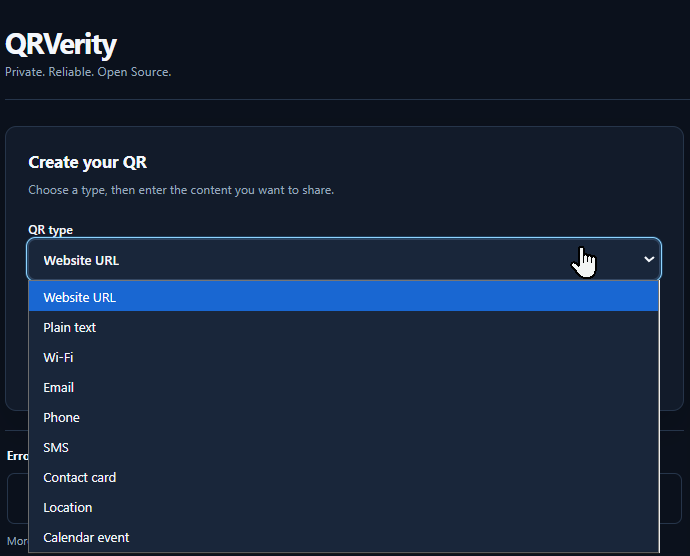

# QRVerity

<p align="center">
  <strong>Private, client-side QR generation with rendered-output verification.</strong>
</p>

<p align="center">
  <a href="https://amirthfultehrani.github.io/QRVerity/">Open the live app</a>
  &nbsp;&bull;&nbsp;
  <a href="https://github.com/amirthfultehrani/QRVerity">View the repository</a>
  &nbsp;&bull;&nbsp;
  <a href="./LICENSE">MIT License</a>
</p>

<p align="center">
  <a href="https://github.com/amirthfultehrani/QRVerity/actions/workflows/ci.yml"></a>
  <a href="https://amirthfultehrani.github.io/QRVerity/"></a>
  <a href="./LICENSE"></a>
</p>

## Contents

- [Preview](#preview)
- [Why QRVerity?](#why-qrverity)
- [Features](#features)
- [Predicted Reliability](#predicted-reliability)
- [Privacy](#privacy)
- [Customization](#customization)
- [Supported QR types](#supported-qr-types)
- [Development](#development)
- [Architecture](#architecture)
- [Security and design constraints](#security-and-design-constraints)
- [Browser support and accessibility](#browser-support-and-accessibility)
- [Limitations](#limitations)
- [License](#license)

## Preview

See the full desktop experience alongside the responsive mobile layout.

<table>
  <tr>
    <th align="center" width="72%">Desktop</th>
    <th align="center" width="28%">Mobile</th>
  </tr>
  <tr>
    <td valign="top">
      
    </td>
    <td valign="top">
      
    </td>
  </tr>
</table>

## Why QRVerity?

> Most QR generators stop after creating the QR.

<table>
  <tr>
    <td align="center" width="20%"><strong>1</strong><br><small>Generates the QR</small></td>
    <td align="center" width="20%"><strong>2</strong><br><small>Renders the final styled output</small></td>
    <td align="center" width="20%"><strong>3</strong><br><small>Rasterizes it</small></td>
    <td align="center" width="20%"><strong>4</strong><br><small>Attempts to decode the rendered result</small></td>
    <td align="center" width="20%"><strong>5</strong><br><small>Compares decoded content with the original payload</small></td>
  </tr>
</table>

The final rendered image is decoded and compared with the intended payload before download.

## Features

<table>
  <tr>
    <th align="left" width="50%">Create QR content</th>
    <th align="left" width="50%">Appearance</th>
  </tr>
  <tr>
    <td valign="top">
      <ul>
        <li><strong>URL</strong> - opens a website</li>
        <li><strong>Plain text</strong> - displays written text</li>
        <li><strong>Wi-Fi</strong> - connects to a Wi-Fi network using encoded credentials</li>
        <li><strong>Email</strong> - opens a pre-addressed email</li>
        <li><strong>Phone</strong> - opens the phone dialer with a number</li>
        <li><strong>SMS</strong> - opens a pre-addressed text message</li>
        <li><strong>Contact / vCard</strong> - saves contact details</li>
        <li><strong>Location / geo</strong> - opens geographic coordinates in a maps app</li>
        <li><strong>Calendar event</strong> - creates a calendar event</li>
      </ul>
    </td>
    <td valign="top">
      <ul>
        <li><strong>Foreground/background colors</strong> - customizes QR code and background colors</li>
        <li><strong>Data module styles</strong> - Square, Rounded, or Dots</li>
        <li><strong>Finder styles</strong> - Square or Rounded corner markers</li>
        <li><strong>Raster logo support</strong> - adds a PNG, JPEG, or WebP logo to the QR code</li>
        <li><strong>Automatic H correction</strong> - uses the strongest error-correction level when a logo is added</li>
      </ul>
    </td>
  </tr>
  <tr>
    <th align="left">Export</th>
    <th align="left">Trust and experience</th>
  </tr>
  <tr>
    <td valign="top">
      <ul>
        <li><strong>PNG export</strong> - downloads a pixel-based image</li>
        <li><strong>SVG export</strong> - downloads a scalable vector image</li>
        <li><strong>Copy image / Copy SVG</strong> - available where browser support allows</li>
      </ul>
    </td>
    <td valign="top">
      <ul>
        <li><strong>Predicted Reliability</strong> - checks rendered decoding, payload match, and contrast</li>
        <li><strong>Responsive layout</strong> - adapts to phones, tablets, and desktops</li>
        <li><strong>Accessibility-oriented controls</strong> - keyboard navigation, labels, focus states, and screen-reader-friendly semantics</li>
        <li><strong>Local browser processing</strong> - generates and checks QR content without sending the payload to a generation server</li>
      </ul>
    </td>
  </tr>
</table>

## Predicted Reliability

<table>
  <tr>
    <th align="center" width="33.33%">GOOD</th>
    <th align="center" width="33.33%">CAUTION</th>
    <th align="center" width="33.33%">RISKY</th>
  </tr>
  <tr>
    <td align="center" valign="top">
      <br>
      <small>Decoded successfully, matched the payload, and passed contrast.</small>
    </td>
    <td align="center" valign="top">
      <br>
      <small>Decoded and matched the payload, but contrast is in the caution range.</small>
    </td>
    <td align="center" valign="top">
      <br>
      <small>Decode, payload match, or contrast check failed.</small>
    </td>
  </tr>
</table>

Colors, module styles, finder styles, and logos are evaluated as part of the final rendered image.

Predicted Reliability is a browser-side rendered-output check, not a guarantee for every physical camera or scanner.

## Privacy

<table>
  <tr>
    <td align="center" width="25%"><strong>Local processing</strong><br>QR content is processed locally in the browser.</td>
    <td align="center" width="25%"><strong>No account</strong><br>No sign-up or account is required.</td>
    <td align="center" width="25%"><strong>No backend</strong><br>No backend is required for QR generation.</td>
    <td align="center" width="25%"><strong>No analytics</strong><br>Your QR payload is not sent to an analytics service.</td>
  </tr>
</table>

## Customization

QRVerity protects important structural regions while letting you control the rendered appearance.

<p align="center">
  
</p>

<table>
  <tr>
    <th align="left" width="33.33%">Colors</th>
    <th align="left" width="33.33%">Shape controls</th>
    <th align="left" width="33.33%">Raster logos</th>
  </tr>
  <tr>
    <td valign="top">Foreground and background colors</td>
    <td valign="top">Square, Rounded, or Dots data modules; Square or Rounded finder styles</td>
    <td valign="top">PNG, JPEG, or WebP logos</td>
  </tr>
</table>

### What is error correction?

QR codes can contain redundant information that helps scanners recover the encoded content when part of the QR is damaged, obscured, dirty, or otherwise difficult to read.

Higher error-correction levels add more redundancy, but can also make the QR denser.

QRVerity uses **M** as the balanced default and automatically uses **H** when a logo is added.

### What is a module?

A module is one of the small marks that makes up a QR code.

QRVerity lets data modules use:

- **Square** - classic square modules
- **Rounded** - square modules with softened corners
- **Dots** - circular data modules

Structural QR patterns remain protected from decorative data-module styling.

### What is a finder?

The three large square markers in the corners of a QR code are finder patterns. Scanners use them to locate and orient the QR.

QRVerity supports:

- **Square** - classic finder appearance
- **Rounded** - softens the outer finder corners while preserving their structure

## Supported QR types

<table>
  <tr>
    <td width="64%" valign="top">
      
    </td>
    <td width="36%" valign="top">
      <table>
        <tr><th align="left">Type</th><th align="left">What it encodes</th></tr>
        <tr><td>URL</td><td>Web links</td></tr>
        <tr><td>Plain text</td><td>Unformatted text</td></tr>
        <tr><td>Wi-Fi</td><td>Network credentials</td></tr>
        <tr><td>Email</td><td>Email address, subject, and body</td></tr>
        <tr><td>Phone</td><td>Phone numbers</td></tr>
        <tr><td>SMS</td><td>Phone number and message</td></tr>
        <tr><td>Contact / vCard</td><td>Contact details</td></tr>
        <tr><td>Location / geo</td><td>Geographic coordinates</td></tr>
        <tr><td>Calendar event</td><td>iCalendar events</td></tr>
      </table>
    </td>
  </tr>
</table>

## Development

### Getting started

```bash
npm install
npm run dev
```

### Development checks

```bash
npm run format:check
npm run check
npm run build
```

## Architecture

| Layer           | Technology or role                    |
| --------------- | ------------------------------------- |
| UI              | Vite + TypeScript + Preact            |
| State           | Signals                               |
| Encoding        | Vendored Nayuki encoder               |
| Rendering       | Canonical SVG renderer                |
| Verification    | jsQR for rendered-output verification |
| Background work | Web Worker for decoding/evaluation    |

## Security and design constraints

<table>
  <tr>
    <td width="50%" valign="top">
      <ul>
        <li>No remote QR-generation backend</li>
        <li>Sanitised raster logos</li>
        <li>Protected QR structural regions</li>
      </ul>
    </td>
    <td width="50%" valign="top">
      <ul>
        <li>Client-side verification</li>
        <li>CSP/security-conscious deployment</li>
      </ul>
    </td>
  </tr>
</table>

For details, refer to [SECURITY.md](./SECURITY.md).

## Browser support and accessibility

| Supported browser | Accessibility and layout            |
| ----------------- | ----------------------------------- |
| Chromium          | Keyboard support                    |
| Firefox           | WCAG-oriented accessibility testing |
| WebKit            | Mobile responsive support           |

## Limitations

- Predicted Reliability is not a guarantee
- Real-world scanning varies by device/environment
- Raster logos only
- No dynamic QR / tracking / accounts
- No PDF/WebP export in v1

## License

Released under the MIT License. See [LICENSE](./LICENSE) and [THIRD_PARTY_NOTICES.md](./THIRD_PARTY_NOTICES.md).
