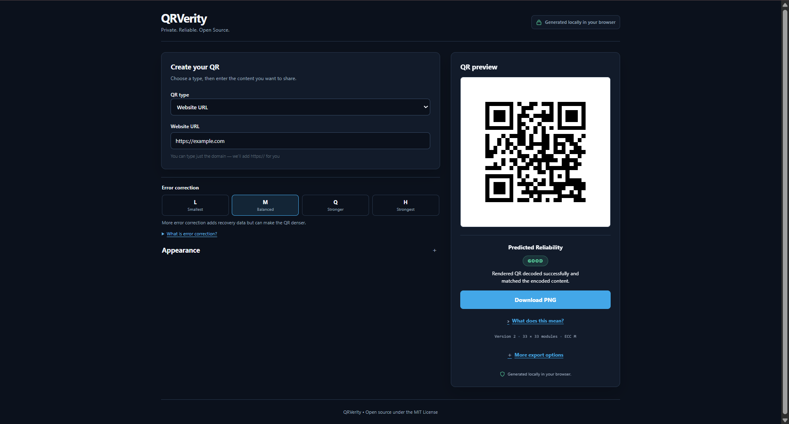
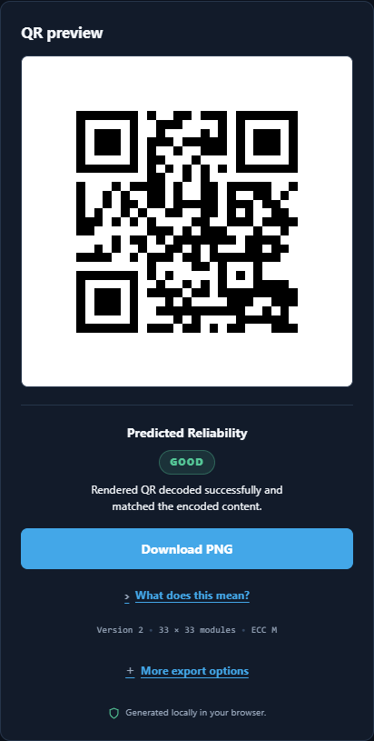
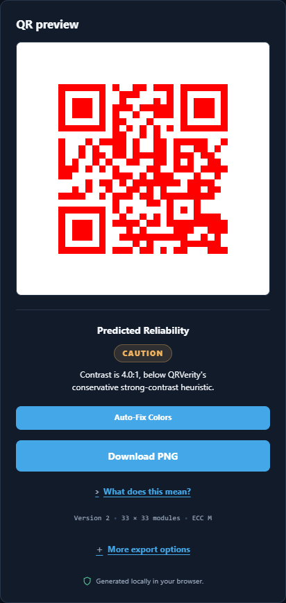
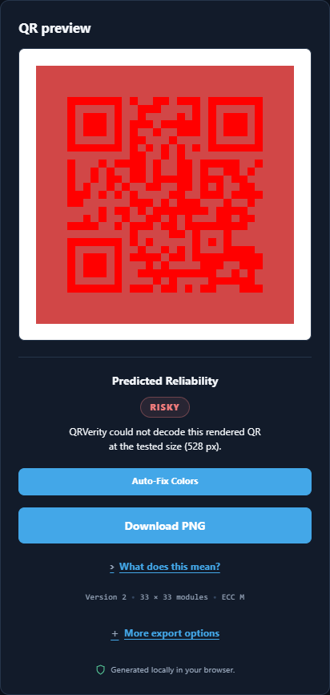
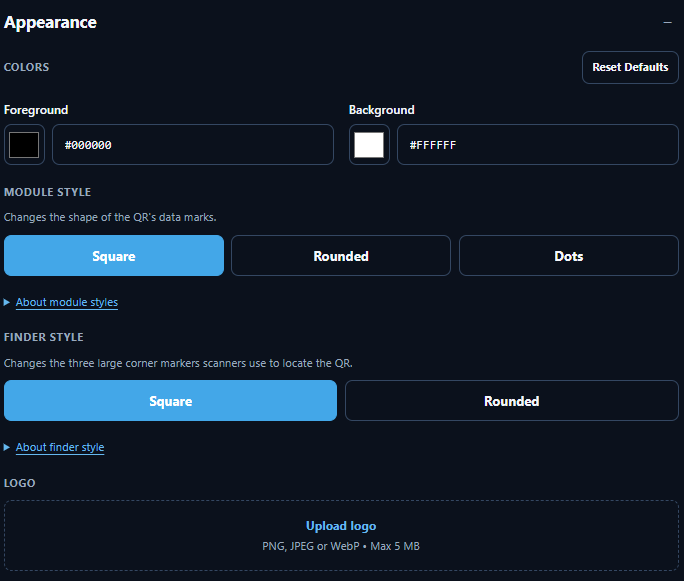
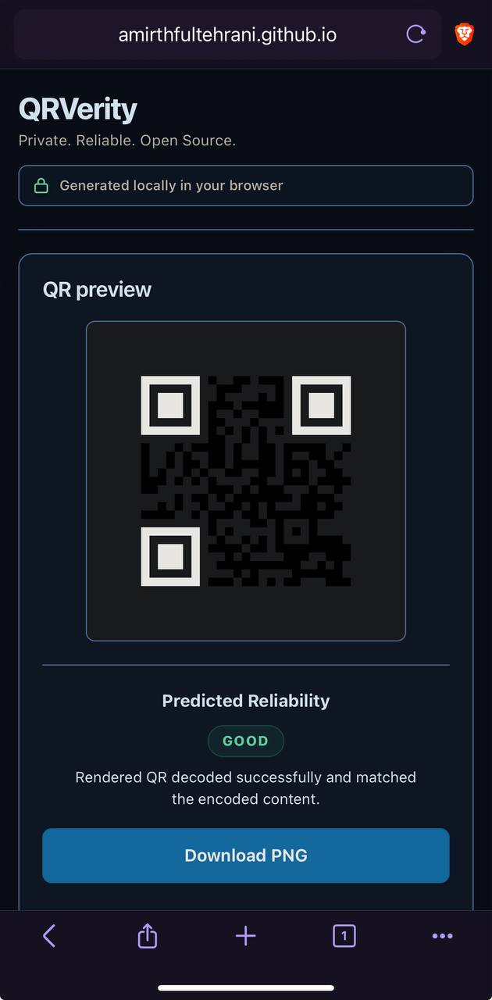

# QRVerity

Private, client-side QR generation with rendered-output verification.

[Live App](https://amirthfultehrani.github.io/QRVerity/) | [Repository](https://github.com/amirthfultehrani/QRVerity) | [License](./LICENSE)

## Preview

<p align="center">
  
</p>

## Why QRVerity?

Most QR generators stop after creating the QR.

QRVerity:

1. generates the QR
2. renders the final styled output
3. rasterizes it
4. attempts to decode the rendered result
5. compares the decoded content exactly with the original encoded payload

The above process powers Predicted Reliability. It verifies that the final rendered image can be decoded and that it contains the data you intended before you download it.

This is still not a guarantee that the QR will scan in every situation. Real-world reliability can change depending on the camera, printer, display, lighting, distance, focus, compression, glare, shadows, and scanner app being used.

## Features

- URL (opens a website)
- Plain text (displays written text)
- Wi-Fi (connects to a Wi-Fi network using encoded credentials)
- Email (opens a pre-addressed email)
- Phone (opens the phone dialer with a number)
- SMS (opens a pre-addressed text message)
- Contact / vCard (saves contact details)
- Location / geo (opens geographic coordinates in a maps app)
- Calendar event (creates a calendar event)
- Foreground/background colors (customizes QR code and background colors)
- Square / Rounded / Dots data module styles (changes QR data marks to square, rounded, or dot shapes)
- Square / Rounded finder styles (changes the appearance of the three large corner markers)
- Raster logo support (adds a PNG, JPEG, or WebP logo to the QR code)
- Automatic H error correction with logos (uses the strongest available error-correction level when a logo is added)
- PNG export (downloads a pixel-based image)
- SVG export (downloads a scalable vector image)
- Copy image / Copy SVG where browser support allows
- Predicted Reliability (checks whether the rendered QR decodes correctly, matches the intended data, and has sufficient contrast)
- Responsive layout (adapts to phones, tablets, and desktops)
- Accessibility-oriented controls (keyboard navigation, labels, focus states, and screen-reader-friendly semantics)
- Local browser processing (generates and checks QR content in the browser without sending the QR payload to a generation server)

## Predicted Reliability

QRVerity provides feedback on the final rendered QR code:

- **GOOD** — the rendered QR decoded successfully, the decoded content exactly matched the original payload, and no contrast warning was triggered.
- **CAUTION** — the rendered QR decoded and matched the original payload, but the foreground/background contrast falls into QRVerity's caution range.
- **RISKY** — QRVerity could not decode the rendered QR, the decoded content did not exactly match the original payload, or the contrast fell below QRVerity's minimum threshold.

<p align="center">
  
  
  
</p>

The implementation checks:

- rendered decode success/failure — can the decoder read the final rendered QR?
- exact payload match — does the decoded data exactly match the intended data?
- contrast heuristic — is there enough foreground/background contrast?

Appearance settings such as colors, module style, finder style, and logos are part of the final rendered image that the decoder sees, but they are not necessarily scored independently.

Predicted Reliability is a browser-side test of the rendered result, not a guarantee of how every physical camera or scanner will behave.

## Privacy

QRVerity respects your privacy by design:

- QR content is processed locally in the browser
- no account required
- no backend required for QR generation
- no analytics

## Customization

QRVerity allows you to change the appearance of a QR code while protecting its important structural regions.

<p align="center">
  
  
</p>

Available options include:

- foreground and background colors
- module styles
- finder styles
- raster logos
- error correction

### What is error correction?

QR codes can contain redundant information that helps scanners recover the encoded content when part of the QR is damaged, obscured, dirty, or otherwise difficult to read.

Higher error-correction levels add more redundancy, but can also make the QR denser.

QRVerity uses **M** as the balanced default and automatically uses **H** when a logo is added.

### What is a module?

A module is one of the small marks that makes up a QR code.

QRVerity lets data modules use:

- **Square** — classic square modules
- **Rounded** — square modules with softened corners
- **Dots** — circular data modules

Structural QR patterns remain protected from decorative data-module styling.

### What is a finder?

The three large square markers in the corners of a QR code are finder patterns. Scanners use them to locate and orient the QR.

QRVerity supports:

- **Square** — classic finder appearance
- **Rounded** — softens the outer finder corners while preserving their structure

## Supported QR types

| Type            | What it encodes                  |
| --------------- | -------------------------------- |
| URL             | Web links                        |
| Plain text      | Unformatted text                 |
| Wi-Fi           | Network credentials              |
| Email           | Email address, subject, and body |
| Phone           | Phone numbers                    |
| SMS             | Phone number and message         |
| Contact / vCard | Contact details                  |
| Location / geo  | Geographic coordinates           |
| Calendar event  | iCalendar events                 |

## Development

```bash
npm install
npm run dev
```

To run development checks:

```bash
npm run format:check
npm run lint
npm run typecheck
npm run test:unit
npm run test:e2e
npm run build
```

## Architecture

- Vite + TypeScript + Preact
- Signals
- vendored Nayuki encoder
- canonical SVG renderer
- jsQR for rendered-output verification
- Web Worker for decoding/evaluation

## Security / design constraints

- no remote QR-generation backend
- sanitised raster logos
- protected QR structural regions
- client-side verification
- CSP/security-conscious deployment

For details, refer to [SECURITY.md](./SECURITY.md).

## Browser support / accessibility

- Chromium
- Firefox
- WebKit
- keyboard support
- WCAG-oriented accessibility testing
- mobile responsive support

## Limitations

- Predicted Reliability is not a guarantee
- real-world scanning varies by device/environment
- raster logos only
- no dynamic QR / tracking / accounts
- no PDF/WebP export in v1

## License

Released under the MIT License. See [LICENSE](./LICENSE).
See [THIRD_PARTY_NOTICES.md](./THIRD_PARTY_NOTICES.md) for open source software components.
